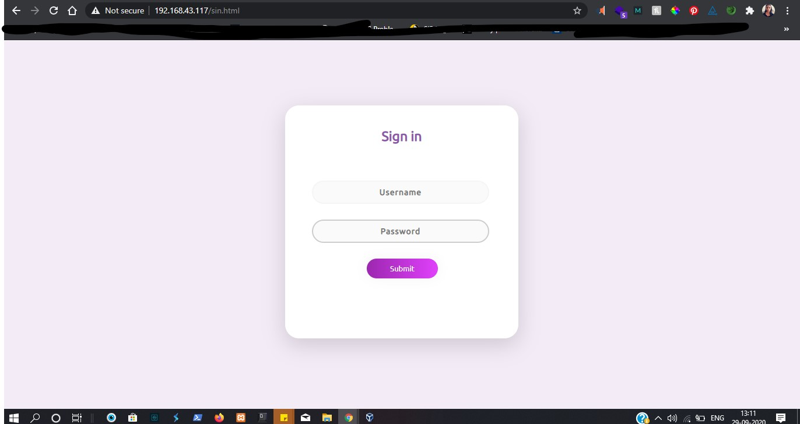
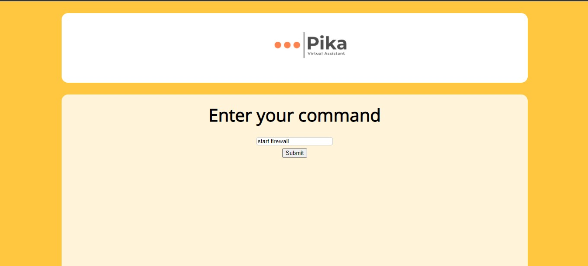

# iiec-Task-2

# 📄 Task Description:  to convert menu-driven application using CLI to the web app using CGI.

web based virtual assistant 

# what it can do ?

This webpage provides facility to run samo Linux Commands and networking commands using webserver   # redhat

# verify weather you have username and passwd

