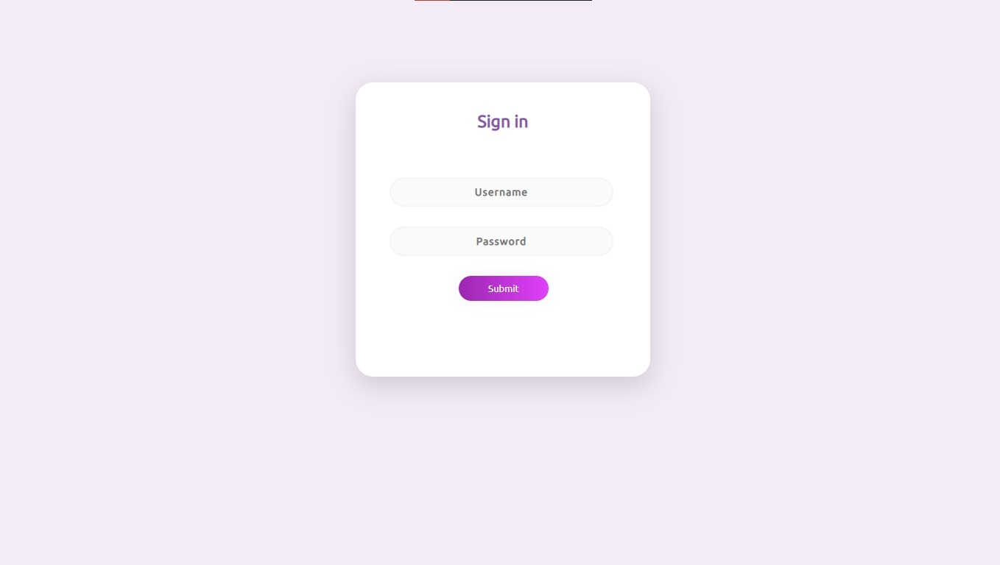

# Pika Virtual Assistant

## 📄 Task Description:  To convert a menu-driven application using CLI to a web application using CGI.

Web Based Virtual Assistant 

## What can it do?

This webpage provides facility to run some Linux Commands and networking commands using webserver *redhat*.

## Verify whether you have username and password.

## Web Based Virtual Assistant 

